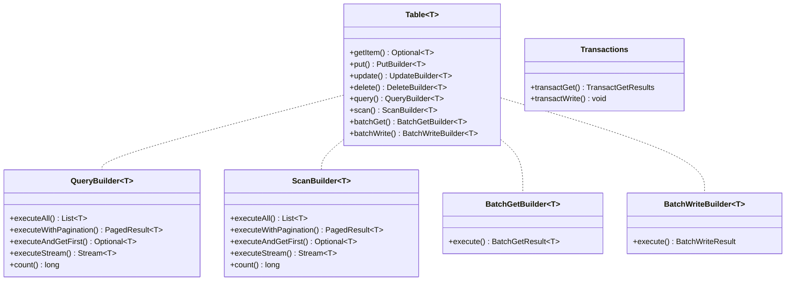
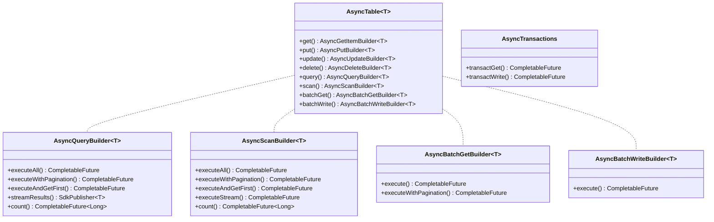

# API Matrix

This matrix summarizes the main sync and async builders and their terminal methods.

## Sync API

## Async API

This diagram is an overview. The notes below cover the exact builder terminals and their caveats.

## Notes

`QueryBuilder` and `ScanBuilder` do not expose a generic `execute()` terminal. Use one of the operation-specific
terminals shown above. Query and scan `executeWithPagination()` return the first page, while `executeAll()` follows
continuation keys and aggregates all pages. Same-table batch-get `execute()` without a projection uses the AWS Enhanced
paginator in both sync and async builders. It follows unprocessed keys from earlier pages to terminal state, without a
library-bounded retry or guaranteed application-level backoff. Its final result is normally without remaining keys.

Same-table projection and cross-table batch-get use low-level paths. Sync projection and sync cross-table have bounded
retries; async projection and async cross-table issue one direct request and can expose `unprocessedKeys`.
`AsyncBatchGetBuilder.executeWithPagination()` consumes only the first page and returns `PagedResult`, which has no
unprocessed-key field. It is not complete batch pagination/retry handling and does not perform the explicit 100-key
validation performed by terminal `execute()`. A configured projection must use `execute()`; this terminal rejects
projections explicitly.

### Transaction and cross-table notes

`Index<T>` and `AsyncIndex<T>` provide `query()` and `scan()` builders. Their terminals are the same as the
corresponding table query and scan rows. The cross-table async batch-get result maps items through `getItems(Table<T>)`,
not through an `AsyncTable<T>` accessor.

### Entity operations

`EntityTable<T>` exposes synchronous `put`, `get`, `query`, `update`, and key-based `delete` methods.
`AsyncEntityTable<T>` exposes the corresponding operations as futures and additionally provides `deleteEntity(T)`. These
are entity-table methods rather than the regular `Table<T>` builder terminals.
